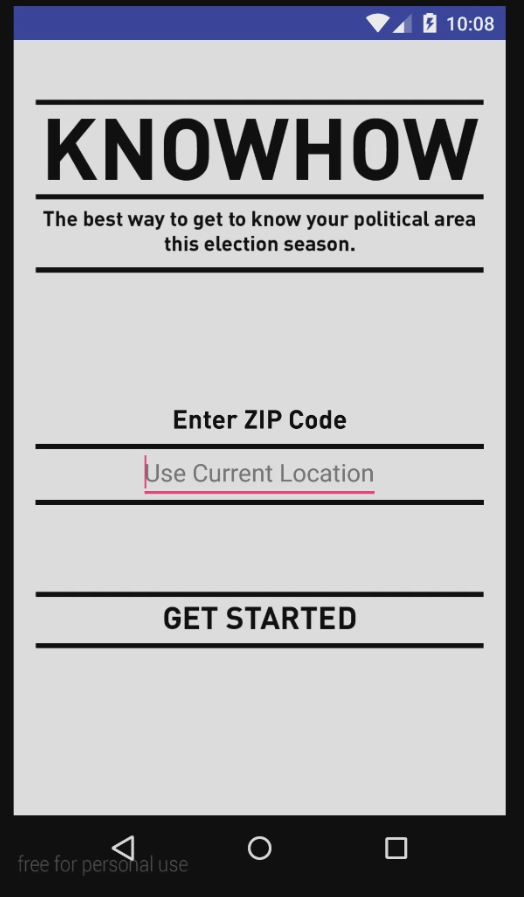

# PROG 02: Represent!

App for CS160 which allows users to learn more about representatives in their area.

## Authors

Rishi Kolady ([koladyr@berkeley.edu](mailto:koladyr@berkeley.edu))

## Demo Video

See [it in action!](https://youtu.be/frAE1P21U_0)

## Screenshots

